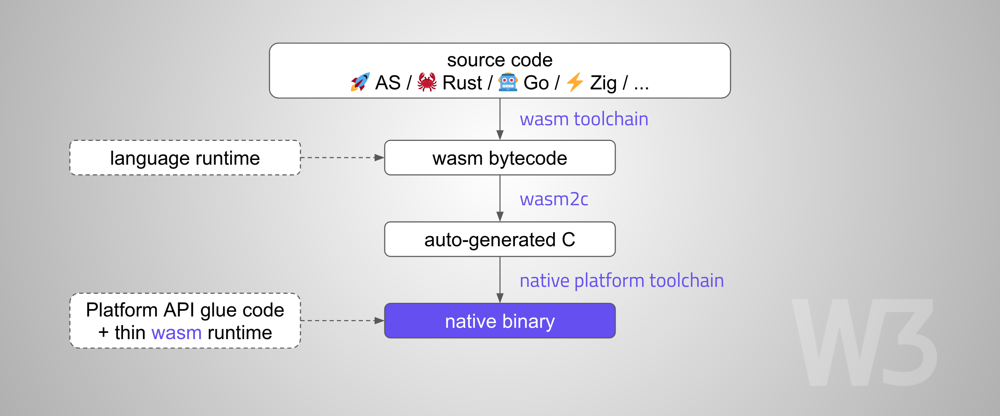

[](https://vshymanskyy.github.io/StandWithUkraine)

# embedded-wasm-apps

Run **native, statically-compiled** apps on any platform, using WebAssembly.  
Examples include [ AssemblyScript](apps/assemblyscript/app.ts), 
[ Rust](apps/rust/src/app.rs), 
[ C/C++](apps/cpp/app.cpp), 
[ TinyGo](apps/tinygo/app.go), 
[ Zig](apps/zig/main.zig), 
[Virgil](apps/virgil/app.v3), 
[WAT](apps/wat/main.wat), 
etc.

## How it works

This does not use [`Wasm3`](https://github.com/wasm3/wasm3) engine. The approach is similar to [`WasmBoxC`](https://kripken.github.io/blog/wasm/2020/07/27/wasmboxc.html) or [`RLBox`](https://hacks.mozilla.org/2020/02/securing-firefox-with-webassembly/):

1. Compile source code to `wasm`
2. Translate `wasm` to `C` using [`wasm2c`](https://github.com/WebAssembly/wabt/blob/main/wasm2c/README.md)
3. Compile produced `C`, link with a thin runtime implementation using the **native platform toolchain**



## Benefits

- Language/toolchain decoupling
- Resilience against attacks (RCE, Control-flow hijacking)
- Sandboxing / SFI (Software Fault Isolation)
- Enables wasm transformations, like instrumentation or [`gas metering`](https://github.com/wasm3/wasm3/blob/main/docs/Cookbook.md#gas-metering)
- Software-based memory virtualization
- Moderate runtime overhead (mostly depends on the source language/runtime)
    - Small performance hit (~10-30% slowdown compared to native modules)
    - Moderate binary size increase
- Highly portable

## Example

```log
$ make APP=rust
    Finished release [optimized] target(s) in 0.00s
$ pio run -e esp32 -t upload
$ pio device monitor
Initializing WebAssembly...
🦀 Rust is running!

$ make APP=assemblyscript
    > npm run asbuild:optimized
$ pio run -e esp32 -t upload
$ pio device monitor
Initializing WebAssembly...
🚀 AssemblyScript is running!

$ make APP=tinygo
$ pio run -e esp32 -t upload
$ pio device monitor
Initializing WebAssembly...
🤖 TinyGo is running!
```

## Building `WASM` apps

Ensure the required tools are in your `PATH`:
- [`WABT v1.0.36`](https://github.com/WebAssembly/wabt/releases/tag/1.0.36)
- [`Binaryen v118`](https://github.com/WebAssembly/binaryen/releases/tag/version_118)

```sh
# AssemblyScript v0.27 (needs Node.js)
make APP=assemblyscript

# Rust 1.80.1
rustup target add wasm32-unknown-unknown
make APP=rust

# C/C++ (needs Clang)
make APP=cpp

# C99 Coremark (needs Clang)
make APP=coremark

# TinyGo v0.33.0 + Go v1.23.0
make APP=tinygo

# Zig v0.13.0
make APP=zig

# Virgil (Aeneas III-7.1632)
make APP=virgil

# WAT
make APP=wat
```

Wasm file comparison:

| AS       | C/C++   | Coremark | Rust    | TinyGo  | Virgil  | WAT     | Zig     |
| -------- | ------- | -------- | ------- | ------- | ------- | ------- | ------- |
| 3951     | 864     | 10800    | 12264   | 1227    | 315     | 223     | 1057    |


## Building and running with `PlatformIO`

```sh
# For ESP32:
pio run -e esp32 -t upload

# For ESP8266:
pio run -e esp8266 -t upload

# For Raspberry Pi Pico:
pio run -e rpi-pico -t upload

# Open serial monitor
pio device monitor --quiet
```

## Building and running with `Particle`

Requires [`particle-cli`](https://docs.particle.io/tutorials/developer-tools/cli/).
Should work on all Particle devices i.e. `Spark Core`, `Photon`, `Electron`, `Argon`, `Boron`, `P2 / Photon2`:

```sh
particle flash MyDevice ./src/*

# Open serial monitor
particle serial monitor --follow
```

### License

This project is released under The MIT License (MIT)
